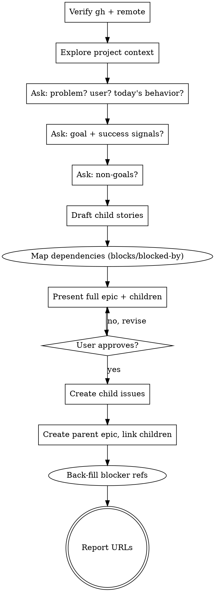

# Epic — From Product Idea To GitHub Issues

Turn a product idea into a parent GitHub epic issue plus child issues
representing the product-level changes needed to deliver it.

This skill is the product-shaping counterpart to `brainstorming`. Where
`brainstorming` ends in a design doc and an implementation plan, **this skill
ends in published GitHub issues** that seed *future* design and brainstorming
sessions — one per child story.

<HARD-GATE>
Do NOT specify implementation details (libraries, schemas, file layouts,
endpoints) unless the user explicitly requests them. Do NOT invoke
writing-plans, frontend-design, or any implementation skill. The terminal
state of this skill is `gh issue create` calls — nothing further.
</HARD-GATE>

**You MUST NOT call `EnterPlanMode` or `ExitPlanMode` during this skill.**
This skill operates in normal mode.

## When to use

- The user has a product idea and wants it captured as actionable GitHub work.
- The user says "create an epic", "open an epic", "/epic", or describes a
  cross-cutting initiative ("we need an admin dashboard").
- You need to seed a multi-step product effort with issues that later
  brainstorming sessions will pick up one by one.

## When NOT to use

- The user wants an implementation plan → use `writing-plans`.
- The user wants a design doc for a *single* feature → use `brainstorming`.
- The work is a single bug or single small change → just open one issue
  directly with `gh`. No epic needed.
- There is no GitHub remote, or the user is working on a non-GitHub repo →
  this skill cannot complete; tell the user and stop.

## Checklist

Create a TodoWrite todo for each item and complete in order:

1. **Verify GitHub remote** — `gh repo view --json nameWithOwner,url` works
2. **Explore project context** — files, README, recent issues/PRs
3. **Frame the problem** — one or two sentence problem statement
4. **Define the goal and success signals** — outcome + observable signals
5. **Identify non-goals** — what is explicitly out of scope
6. **Decompose into child stories** — vertical, user-visible slices
7. **Map dependencies** — which children block which; flag the critical path
8. **Present epic + children for approval** — full draft, including blockers
9. **Create child issues** — capture issue numbers; use placeholders for blockers, then back-fill once all numbers are known
10. **Create parent epic issue** — body links to children via task list, in dependency order
11. **Back-fill blocker references** — edit each child to replace placeholders with real `#N` references
12. **Report URLs** — paste links to all created issues, plus a one-line summary of the dependency order

## Process flow



## Verifying the GitHub remote

Before any product questions, confirm we can publish the result:

```bash
gh repo view --json nameWithOwner,url
```

If this fails (no `gh`, not authenticated, no remote, not a GitHub repo),
stop and tell the user. Do not proceed to product questions if there is
nowhere to publish the output.

If multiple remotes exist (fork + upstream), confirm with the user which
repo the epic should be filed against before continuing.

## Asking questions

Follow the same one-question-at-a-time discipline as `brainstorming`.

The questions are different though — they are **product** questions, not
design questions. In order:

1. **Who feels the problem and when?** ("admin users when onboarding a new
   teammate", "billing leads at the end of the month")
2. **What do they do today, and why is it bad?** (the gap)
3. **What outcome do we want?** (one sentence, user-facing)
4. **How will we know we got there?** (observable signals — qualitative is
   fine; metrics are not required)
5. **What is explicitly out of scope?** (force the user to name at least one
   thing — non-goals are how scope stays bounded)
6. **What are the obvious child pieces?** (let the user list, then refine)

If the user gives you an answer that's actually a solution ("add a settings
page"), reflect it back as a problem ("so the problem is that users can't
configure X today?") before continuing.

**Optional:** for ambiguous or large-scope inputs, dispatch the
`product-manager` agent for a second opinion on framing or decomposition
before presenting the draft. This is especially useful when the user's
initial pitch is one sentence with no problem statement.

## Decomposing into child stories

Each child issue is a **product-level slice**, not an engineering task.

**Good child stories:**
- "Billing details screen" — admins can see and edit billing info
- "Team admin screen" — admins can invite, remove, and change roles
- "Audit log view" — admins can see what changed and who did it

**Bad child stories (do not produce these):**
- "Add `billing` table" — that's an implementation step
- "Set up routes for /admin/*" — same
- "Wire up auth middleware" — same

Each child story should:
- Be deliverable as its own brainstorm/design/implementation cycle later.
- Have a clear user (or admin/operator) and a clear thing they can now do.
- Stand on its own — if you removed any other child, this one would still
  make sense to ship.

If the user's idea decomposes into one child, it's not an epic — open a
single issue instead. If it decomposes into more than ~7 children, ask
whether two epics would be cleaner.

## Mapping dependencies

After the children are drafted but **before** presenting them for approval,
walk through the list and identify dependencies. This is product-level
sequencing, not technical sequencing — you're asking "which user-visible
capability must exist before this other one is meaningful?", not "which
table do we need first."

Ask the user explicitly. Do not infer dependencies silently. A good prompt:

> "Of these children, are any of them genuinely blocked by another? I'm
> looking for cases where the later one is meaningless or shippable-but-
> useless without the earlier one."

For each child, capture:
- **Blocked by** — issues that must ship first for this one to be valuable.
- **Blocks** — the inverse, derived automatically.
- **Independent** — explicitly note when nothing blocks it. This is a
  feature, not an omission: it tells reviewers the work can start in
  parallel.

**Default to independence.** A dependency that exists only because "it
makes sense to do it first" is not a real blocker — it's a preference.
Reserve "blocked by" for hard ordering: the later issue cannot be shipped
(or makes no sense to ship) until the earlier one is done.

**Critical path.** If three or more children form a chain, call it out in
the parent epic's "Notes" section as the critical path. This is what tells
the team where to start.

**GitHub semantics.** GitHub does not have first-class blocking
relationships across all repos (sub-issues exist, but blocking does not).
Use the textual conventions `Blocked by #N` and `Blocks #N` in issue
bodies — these are the de facto standard, parsed by most tooling and
recognizable to humans. Do not invent new syntax.

**Cycles.** If your dependency graph has a cycle (A blocks B, B blocks A),
something is wrong — usually the two children are actually one, or the
boundary between them is in the wrong place. Stop and re-decompose.

## Issue templates

Use these formats. Markdown only — no HTML, no frontmatter.

### Parent epic body

```markdown
## Problem
<1-2 sentences. Who feels it, when, why it matters.>

## Goal
<One sentence. The user-facing outcome we want.>

## Success signals
- <Observable signal 1>
- <Observable signal 2>

## Non-goals
- <Thing we are explicitly not doing>
- <Thing we are explicitly not doing>

## Child stories
List children in dependency order. Independent items can appear anywhere;
blocked items must appear after what blocks them.

- [ ] #<n> <Child title>
- [ ] #<n> <Child title> — blocked by #<n>
- [ ] #<n> <Child title> — blocked by #<n>, #<n>

## Critical path
<Optional. Include only if there's a chain of 3+ children. Example:
"#12 → #14 → #17 must ship in order. #13 and #15 can run in parallel.">

## Notes
<Any relevant context, links to prior discussion, constraints the team
should know about. Optional.>
```

### Child issue body

```markdown
Part of #<epic-number>.

## Problem
<1-2 sentences. Who, when, why.>

## Goal
<One sentence. User-facing outcome for this slice.>

## In scope
- <User-visible capability>
- <User-visible capability>

## Out of scope
- <Thing this issue does NOT cover>

## Dependencies
Blocked by: #<n>, #<n>   <!-- omit the line if independent -->
Blocks: #<n>             <!-- omit the line if it blocks nothing -->

## Open questions
- <Anything to resolve in the future brainstorming session>
```

If a child is fully independent, write a single line `Dependencies: none`
under the heading instead of omitting the section entirely — explicit
independence is more useful to reviewers than a missing section.

Both bodies stay at the product level. **No file paths, no schemas, no
library names** unless the user explicitly told you to include them.

## Approval gate

Before any `gh` call, present the **full** draft — parent epic body and
every child issue body — in one message and ask the user to approve or
request edits. Do not create issues incrementally. Iterate on the draft
until the user explicitly approves.

## Creating the issues

Order matters: children first (so we have their numbers), then parent
(whose body references them).

For each issue, **always pass the body via a heredoc to a temp file** to
preserve formatting and avoid shell-escaping bugs:

```bash
BODY_FILE=$(mktemp)
cat > "$BODY_FILE" <<'EOF'
Part of #42.

## Problem
...
EOF

gh issue create \
  --title "Billing details screen" \
  --body-file "$BODY_FILE"

rm "$BODY_FILE"
```

Capture the issue number / URL from each `gh issue create` response. The
URL ends in `/issues/<n>`.

For the parent epic, do the same, with the child task list filled in
using the captured numbers:

```markdown
## Child stories
- [ ] #<child1> Billing details screen
- [ ] #<child2> Team admin screen
```

After the parent is created, edit each child to point at the now-known
parent number (the children were created before the parent existed):

```bash
gh issue edit <child-number> --body-file "$UPDATED_BODY_FILE"
```

(Alternatively: create the parent first with placeholder text, create
children referencing it, then update the parent body. Either order works
— pick one and be consistent within a single run.)

### Resolving blocker references

When child A is blocked by child B, you don't know B's issue number until
B has been created. Handle this with a deterministic placeholder + back-fill:

1. **Decide a creation order before the first `gh` call.** Topological
   sort by dependency: issues with no blockers first, then issues whose
   blockers are already created. Cycles → stop and re-decompose (see
   "Mapping dependencies" above).
2. **Use placeholder tokens** in initial bodies for any blocker not yet
   created. Example: `Blocked by: <<BLOCKED_BY:billing-screen>>` where
   `billing-screen` is a slug you assigned to that child during drafting.
3. **Maintain a slug → issue-number map** as you create each issue. After
   each `gh issue create`, record `slug = #N`.
4. **After all children + parent exist**, replace every placeholder
   token with the real `#N` reference and `gh issue edit --body-file`
   each affected issue.

Topological order means most or all blocker references are already known
at creation time, minimizing back-fills. The placeholder mechanism exists
for the cases where it isn't (e.g. mutual references between siblings via
the parent's "Critical path" notes).

**Labels** are optional. If the repo has labels like `epic` or
`type:epic`, apply them via `--label`. Do not invent labels — only use
ones that already exist (`gh label list`). Skip labels if unsure.

## Reporting back

After all issues are created, output a short summary:

```
Epic: <url>
Children (dependency order):
  - <url> — <title>                     (independent)
  - <url> — <title>                     (independent)
  - <url> — <title>                     (blocked by #<n>)
  - <url> — <title>                     (blocked by #<n>, #<n>)

Critical path: #<n> → #<n> → #<n>       (omit if none)
Start in parallel: #<n>, #<n>           (omit if everything is sequential)
```

Then stop. Do not invoke any other skill. Do not start brainstorming the
first child — that is a separate session, started by the user when
they're ready.

## Common mistakes

| Mistake | Fix |
|---|---|
| Children read like engineering tasks | Rewrite each as a user-visible capability. "Add migration" → "Admins can edit billing details". |
| Problem statement is a solution in disguise ("we need an admin dashboard") | Ask "what can't admins do today?" and use the answer. |
| Skipping the approval gate and creating issues immediately | Always present the full draft first. `gh` calls are not free to undo. |
| Body contains schema, file paths, or library names | Strip them. Implementation belongs in the future per-child design session. |
| Listing 12 children | Ask the user whether this is two epics. >7 is a smell. |
| Creating issues without verifying the remote first | `gh repo view` is step one, every time. |
| Inferring "blocked by" silently because work feels sequential | Ask the user. Sequencing-by-preference is not a blocker. Reserve "blocked by" for hard ordering. |
| Dependency cycle (A blocks B, B blocks A) | The boundary between them is wrong. Re-decompose; do not paper over with notes. |
| Creating children in arbitrary order, then editing every one to add `#N` blockers | Topologically sort first; create independent issues before their dependents so most blocker refs are known at creation time. |

## Red flags — stop and reconsider

- About to call `gh issue create` without showing the user the full draft → STOP.
- About to write "implement", "build", "set up", or "wire up" in a child title → that's an engineering task, not a product story.
- Cannot articulate the problem in one sentence → keep asking; don't draft yet.
- About to write child stories that mention specific frameworks or files → those details belong in the future brainstorm of that child, not in the issue.
- About to publish issues without a "Dependencies" line on each child → STOP. Even "Dependencies: none" is information; missing is ambiguity.

## Notes

- Issues are visible to collaborators immediately. Confirming with the user before publishing is non-negotiable, even in auto mode.
- This skill never closes, edits, or deletes existing issues unless the user asks.
- Do not push, comment, or notify (`gh issue create` is enough).
